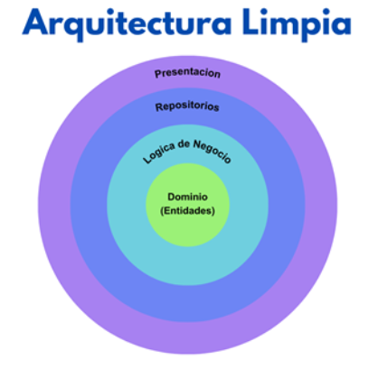

# test Rick And Morty Map

Aplicación móvil Flutter que permita a los usuarios explorar los personajes de Rick y Morty y el uso de mapas.
Visualizando información detallada de personajes todo ello obtenido a través de la API oficial de Rick y Morty y el uso de mapas usando la herramienta de flutter map.

## Instalación

**version de flutter 3.5.4**

1. Clona el repositorio:
   ```sh
   git clone https://github.com/yourusername/test_rickandmorty_map.git
2. Abre en tu IDE de preferencia
3. Navega a la ruta del proyecto
4. Instala las dependencias con el comando
    ```sh
   flutter pub get
5. Correr el proyecto con el comando 
    ```sh
    Flutter run
## Arquitectura Limpia

En este proyecto se utilizó arquitectura limpia basada en una serie de capas conformadas por dominio (entidades), lógica de negocio y presentación ubicadas en la carpeta de infraestructura y presentación, donde se alojan las vistas, widgets, proveedores.



### Dominio (domain)
es la capa definida por el negocio, es decir, no debe estar atada a ningún concepto técnico y dentro de ella vemos las entidades y los casos de uso.

### Infrastructure (Logica de negocio)
Esta capa maneja la lógica de negocio que debe llevar cada caso de uso de los modelos de dominio, es decir si tengo una clase dominio que debe llevar 3 métodos, entonces se debe seguir estas reglas como mínimo, a su vez se encuentra el manejo de la implementación de los repositorios, es decir es el puente entre la capa de dominio y la capa de presentación.

### Presentation (presentacion)
Esta capa maneja las vistas y la estructura de los widgets del el aplicativo móvil. Para este proyecto se utilizó la organización basada en carpetas por cada módulo donde van alojando las vistas (screen), los proveedores de servicios (providers), controladores (controller) para el flujo de servicio. Además, se tiene una carpeta de widgets donde se alojan los widget que se utilizan en diferentes vistas implementando la reutilización.

## Herramientas Utilizadas

- **MobX**: Gestor de estado para aplicaciones reactivas.
- http**: Paquete para realizar solicitudes HTTP.
- **flutter_map:**: Paquete para crear mapas interactivos.
- **Mockito**: Framework de mocking para pruebas unitarias.
- **Go router**: Manejo de navegación de vistas.
- **Shared preference**: Persistencia de datos a nivel local.

## Características Principales:

1. **Consumo de la API de Rick y Morty**:
- Utilización del paquete http para realizar solicitudes a la API y obtener los datos de personajes.
- Implementación de un mecanismo de paginación para cargar datos de forma eficiente.
2. **Gestión de Estado con MobX**:
- Uso de MobX para administrar el estado de la aplicación de manera reactiva y eficiente.
- Creación de stores para gestionar los datos de personajes, filtro de busqueda, CRUD favoritos.
- Observación de cambios en el estado para actualizar la interfaz de usuario de forma automática.
3. **Arquitectura Limpia**:
- Uso de repositorios para encapsular la lógica de acceso a datos.
- Aplicación de principios SOLID para mejorar la mantenibilidad y escalabilidad del código.
- Separación clara y menejo de las capas.
4. **Personalización y Adaptación**:
-Implementación de opciones de personalización para que el usuario pueda filtrar y ordenar los resultados.
-Adaptación de la interfaz de usuario a diferentes tamaños de pantalla y orientaciones.
5. **Reutilización de Widgets**:
- Creación de widgets personalizados y reutilizables para elementos comunes de la interfaz de usuario, como tarjetas de personajes, listas y detalles.
- Uso de composiciones de widgets para construir interfaces más complejas de forma modular.
6. **Pruebas Unitarias**:
-Escritura de pruebas unitarias para garantizar la calidad del código y detectar errores tempranamente.
-Cobertura de pruebas para los modelos de datos, repositorios y lógica de negocio.
7. **Visualización de Ubicaciones en un Mapa**:
-Utilización del paquete flutter_map para mostrar las ubicaciones de los personajes en un mapa interactivo.
-Personalización del mapa con marcadores, pop-ups y diferentes tipos de capas.